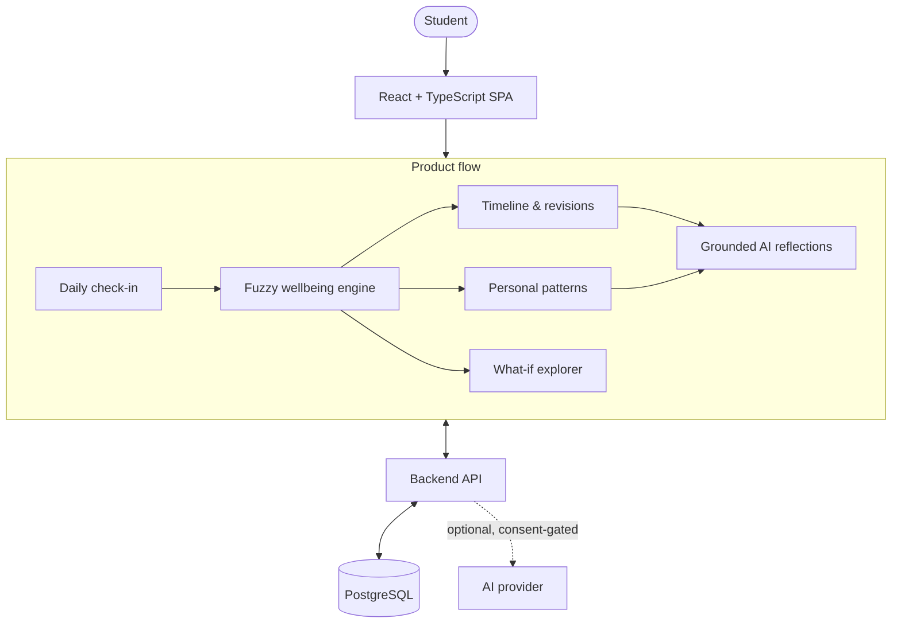

# Student Wellbeing

Turn everyday routine data into transparent, explainable wellbeing insights.

[](https://stressdetect.netlify.app/)
[](./LICENSE)
[](https://react.dev/)
[](https://www.typescriptlang.org/)

**Live Demo: [stressdetect.netlify.app](https://stressdetect.netlify.app/)**

## Overview

Student Wellbeing is a full-stack web app that helps students notice patterns in their sleep, workload, and routines over time. Each daily check-in is scored by a fuzzy-logic reasoning engine that produces a routine-based wellbeing index — every input membership and activated rule behind that score is shown to the user, not hidden inside a black box.

The app is explicitly **not** a diagnostic or clinical tool. It's a personal, explainable record of routine and self-reported strain, designed to surface trends a student might otherwise miss.

## Key Features

- **Daily check-ins** — guided sliders for sleep, workload, deadlines, screen time, recovery, and self-reported strain
- **Explainable scoring** — a fuzzy-logic engine computes a wellbeing index with full visibility into the reasoning (input memberships, activated rules, contribution breakdown)
- **Timeline & revisions** — every edit is kept as an immutable, dated revision instead of silently overwriting history
- **Personal patterns** — descriptive comparisons between recent and baseline periods, with deviation detection and accessible chart views
- **What-if explorer** — sandbox hypothetical routines against the same live model without touching saved history
- **Grounded AI reflections** — optional, consent-gated reflections where an LLM only selects and phrases highlights; every fact and number displayed is backend-verified, with a deterministic fallback when AI is unavailable
- **Full data ownership** — one-click data export and self-service deletion of history or account
- **Accessible by default** — keyboard-navigable, labeled controls, and responsive layout throughout

## Tech Stack

**Frontend** — React 18, TypeScript, Vite, Chart.js, Axios, Vitest + Testing Library

**Backend** — FastAPI (Python), PostgreSQL — see the [backend repository](https://github.com/raihanahmadkhan/studentStressDetector-backend)

**AI** — optional, consent-gated grounded reflections with a verified-template fallback

## Architecture



## Local Setup

Requires Node 20+.

```bash
npm install
npm run dev
```

The app expects a running instance of the companion backend API — see its [repository](https://github.com/raihanahmadkhan/studentStressDetector-backend) for setup instructions.

## Limitations

- The wellbeing index is an authored heuristic, not a medically validated or diagnostic measurement
- Personal pattern insights are descriptive, not predictive or causal
- Requires an active connection to the backend; there is no offline mode
- Not a substitute for professional mental health support

## Backend Repository

[studentStressDetector-backend](https://github.com/raihanahmadkhan/studentStressDetector-backend)

## License

MIT — see [LICENSE](./LICENSE).
